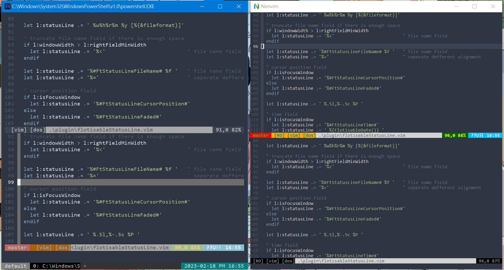

# Flotisable Status Line
a self use plugin to set up the status line fo vim

[Traditional Chinese README](README_zh-TW.md)

# Index
- [Screenshot](#screenshot)
- [Statusline Field](#statusline-field)
  - [Git Branch Field](#git-branch-feild)
  - [Flag Field](#flag-field)
  - [File Name Field](#file-name-field)
  - [Cursor Position Field](#cursor-position-field)
  - [Time Field](#time-field)
- [Customize the Color of the Field](#customize-the-color-of-the-field)

# Screenshot


# Statusline Field
I seperate the statusline into five filed, and each field can be set to different color

## Git Branch Filed
this field shows the branch of git repository if the file is belong to a git repository

this is based on the **git** commant

so if the command is not installed or can not be used in command line, the field will be empty or will get an error message

## Flag Field
this field shows the vim flag in the following order

  1. preview
  2. help
  3. readonly
  4. modified
  5. filetype

## File Name Field
this field shows the file name relative to the present working directory

## Cursor Position Field
this field shows the cursor position with the following format

  line number, column number  file percentage

## Time Field
this field shows the system time

this is based on the **date** command

so if the command is not installed or can not be used in command line, the field will be empty or will get an error message

# Customize the Color of the Field
to customize the color of the field in the vimrc

first add this line in vimrc

```
g:flotisableStatusLineCustomColor = 1
```

then add **highlight** command below this line

the highlight group of each field is listed below

  - git branch field      : User1
  - flag field            : User2
  - file name field       : User3
  - cursor position field : User4
  - time field            : User5
